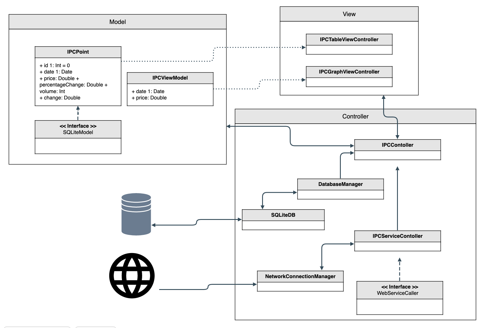

# GBM Challenge
GBM Challenge is a demo project to show the developer's iOS coding skills. Written in Swift 5 and shows a simple navigation:
```
Authentication View -> Home View (IPC Graph) -> Detail View  
```
The data is retrieve from the [REST service](https://run.mocky.io/v3/cc4c350b-1f11-42a0-a1aa-f8593eafeb1e) services using the native URLSession.

All data is stored using SQLite 3 native libraries.

The graph is done with the Cocoapods library ['Charts'](https://cocoapods.org/pods/Charts)

## Architecture

The app architecture followed the MVC pattern. The classes organization is shown with the following imag:




## Author

* Manuel González Lara
* Mobile Developer
* <manu.gonla@gmail.com>

